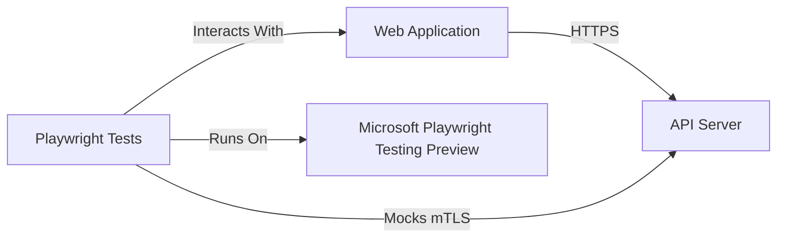

# mTLS Playwright Demo

This project demonstrates how to use Playwright to test a web application that communicates with an API server using mutual TLS (mTLS) authentication. It utilizes Microsoft Playwright Testing Preview, a fully managed service for end-to-end testing built on top of Playwright, to run tests at scale in the cloud.

## Project Overview

The project consists of three main components:

1. **Web Application**: A simple HTML/JavaScript web application that fetches data from an API server when a button is clicked.
2. **API Server**: An Express.js server that serves data to the web application over an mTLS-protected endpoint.
3. **Playwright Tests**: End-to-end tests written using Playwright to verify the functionality of the web application and its communication with the API server.

## Prerequisites

Before running the project, make sure you have the following installed:

- Node.js (version 12 or above)
- npm (Node Package Manager)
- A Microsoft Playwright Testing Preview workspace

## Installation

1. Clone the repository: git clone https://github.com/your-username/mtls-playwright-demo.git
2. Navigate to the project directory: cd mtls-playwright-demo
3. Install the dependencies: npm install

## Running the Project

1. Start the API server: npm run start:api
2. In a separate terminal, start the web application: npm run start:web
3. Configure your Playwright Testing Preview workspace by adding a `playwright.config.js` file with your access token and service endpoint.
4. Run the Playwright tests: npm test

The tests will run using Microsoft Playwright Testing Preview, leveraging cloud-hosted browsers for parallel execution.

## Component Diagram

The diagram above illustrates the interactions between the components:
- The Web Application communicates with the API Server over HTTPS.
- Playwright Tests interact with the Web Application to simulate user actions and assertions.
- Playwright Tests also mock the mTLS communication between the Web Application and the API Server to enable testing without modifying the application code.
- Playwright Tests run on Microsoft Playwright Testing Preview, utilizing cloud-hosted browsers for parallel execution.